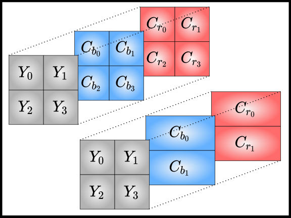

<div align="center">
<h1 align="center">
    JPEG Decoder
</h1>

[](https://pytorch.org/)

\[[Specification](./docs/itu-t81.pdf)\]

JFIF-compliant decoder (ISO/IEC 10918-5:2013)

<p align="center">
     
</p>
</div>


## Summary

* [Introduction](#introduction)
* [Running](#running)
* [Implementation](#implementation)
* [Credits](#credits)

## Introduction

This repository contains an implementation of a decoder for the [JPEG](https://wacv2022.thecvf.com/) image format, written entirely in C without any dependency, following its [official specification](./docs/itu-t81.pdf). It supports JFIF files in the sequential format, or progressive format without upsampling. It uses an [implementation](./docs/loeffler.pdf) of the Loeffler algoritm for fast DCT computation.


## Running

You may compile using make after positioning in the root folder:
```bash
cd ./jpegdecoder/
make
```

Run the executable as follows:
```bash
./bin/jpeg2ppm img.jpeg -opt
```

Where `opt` can be either:
- `-v` to have the verbose mode which displays the header of the image
- `-b` to have the blabla mode which does not export in ppm but displays the results of each - step for each MCU
- `-p` to save all intermediate images when decompressing a progressive image


## Implementation

Our decoder supports images compressed according to the JFIF-APP0 sequential or progressive format. Corrupted images or non-compliant images will cause an appropriate error message.
Images with progressive upsampling are currently unsupported.
The supported subsampling modes are the 4 most common ones:
- vertical subsampling
- horizontal subsampling
- vertical and horizontal subsampling

The `autotest` folder contains an automatized test to compare uncompressed images to image rasters in the `ppm` format.

```bash
source ./autotest/autotest.sh
```

## Credits

This decoder was written from scratch by Habib Slim, Nathan Boulanger and Lucas Druart.
